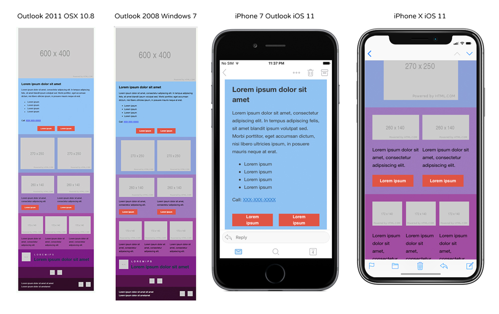

# Responsive Email Template
Fast and easy way to start coding Email Templates for beginners.

## About the Template
[Click here](http://jagawebdev.com/responsive-email-template/) to view the Example email template.
* Template max width is 600px
* Used inline styling
* Tested for most popular email clients by EmailOnAcid.com


### Getting Started
1. Download the files from GitHub and opened it in your text-editor.
2. Email template components are broken down by layout in the 'Layouts' folder.
3. Copy and paste the desired layout from the 'Layouts' folder into the 'boilerplate-index.html' file and customize the code for your project.

### Best Practices
* Avoid using *p* tag. It give much trouble with some clients.
* Always put *display=block* to all *img* tags, it removes small spacing below images.
* To make sure images are responsive use two *height* attributes (height="" height="400") for *img* tags. Always define the *height* on the second *height* attribute.
* Always fill *img* *alt* attributes for accessibility reasons and it provides context for images if images are disabled.
* Always apply *font-family* to texts in the *td* tags
* Always end lists with below code. It removes added extra bullet point by email clients.
```
<div style="display:none;">&nbsp;</div>
```
* Don't use *padding* attribute to add space between 2 items. Use *td* with *width* attribute
```
<td bgcolor="91c4f2" width="20" style="font-size:0 line-height:0;padding-top:0;padding-bottom:0;">
  &nbsp;
</td>
```

### Resources
* Supported CSS Properties: [pinpointe.com](https://www.pinpointe.com/blog/email-campaign-html-and-css-support)
* Ultimate Guide to CSS:[campaignmonitor.com](https://www.campaignmonitor.com/css/)
* CAN-SPAM Act: [A Compliance Guide for Business](https://www.ftc.gov/tips-advice/business-center/guidance/can-spam-act-compliance-guide-business)
* Image Place Holder: [Placeholder.com](https://placeholder.com/)
* Countdown: [Sendtric.com](https://www.sendtric.com/)
* Email Spam Test: [mail-tester.com](https://www.mail-tester.com/)
* Content Ratio: [emailonacid.com](https://www.emailonacid.com/blog/article/email-marketing/should-i-be-concerned-with-text-and-image-ratio-in-email/)
* UTM Codes [Track Your Campaigns](https://www.launchdigitalmarketing.com/what-are-utm-codes/)
* [Campaign URL Builder](https://ga-dev-tools.appspot.com/campaign-url-builder/)

### Acknowledgments
* New to Email Coding?: [Realygoodemails.com](https://explore.reallygoodemails.com/new-to-email-coding-heres-where-to-start-2494422f0bd4)
